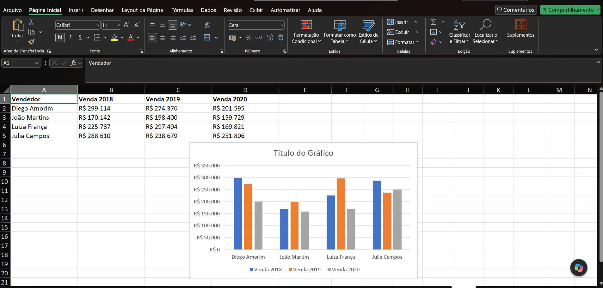

# 📘 Módulo 01 — Atalhos

---

## 📌 Contexto do Módulo

Primeiro módulo da trilha Excel Impressionador. Introduz os atalhos de teclado essenciais do Excel — navegação, seleção, formatação, criação de tabelas e gráficos — como base de produtividade para todo o restante da trilha.

A base de dados utilizada nos exemplos é uma planilha de vendas por equipe, vendedor e data.

---

## 🎯 Objetivo

Desenvolver conhecimentos práticos e operacionais relacionados a:

- Navegação rápida entre extremidades de um intervalo de dados
- Seleção de linhas e colunas inteiras sem uso do mouse
- Criação de Tabelas formatadas e ativação/desativação de filtros
- Inserção rápida de data e hora
- Abertura da formatação de células
- Colar especial (valores e fórmulas)
- Criação de gráficos instantâneos
- Preenchimento automático de padrões de texto (Flash Fill)

---

## 📂 Estrutura do Módulo

```bash
modulo-01-atalhos/
│
└── Planilhas/
    ├── Atalhos_-_Aprenda_mais_todo_dia.xlsx
    └── print-alt-f1.png
```

---

## 🧠 Conceitos Abordados

### 🔹 CTRL + SETA e CTRL + SHIFT + SETA

Navegam até a última célula preenchida em uma direção (`CTRL + SETA`) ou fazem essa mesma navegação já selecionando o intervalo percorrido (`CTRL + SHIFT + SETA`). Essenciais para se mover e selecionar rapidamente em bases de dados extensas.

### 🔹 CTRL + T

Transforma um intervalo de dados em uma Tabela formatada do Excel, com filtros automáticos, formatação alternada e referências estruturadas.

### 🔹 CTRL + ESPAÇO e SHIFT + ESPAÇO

Selecionam, respectivamente, a coluna inteira e a linha inteira da célula ativa — substituem a seleção manual por arraste do mouse.

### 🔹 CTRL + SHIFT + L

Ativa ou desativa os filtros de uma tabela com um único atalho, sem precisar acessar a guia Dados.

### 🔹 CTRL + PGUP / CTRL + PGDN e CTRL + ALT + T

`CTRL + PGUP` e `CTRL + PGDN` navegam entre as planilhas do arquivo (anterior/próxima). `CTRL + ALT + T` insere a data e a hora atuais na célula selecionada.

### 🔹 CTRL + 1

Abre a caixa de diálogo de Formatação de Células, dando acesso a todas as opções de número, alinhamento, fonte, borda e preenchimento em um só lugar.

### 🔹 ALT + C, V, V e ALT + C, V, T

Sequências de colar especial: `ALT, C, V, V` cola apenas os valores (sem fórmulas) e `ALT, C, V, T` cola apenas a formatação, permitindo copiar dados sem arrastar fórmulas ou vice-versa.

### 🔹 O Atalho ALT (ALT + F1)

Gera um gráfico instantâneo na própria planilha a partir do intervalo de dados selecionado, sem precisar acessar a guia Inserir.

### 🔹 CTRL + E

Aciona o Preenchimento Relâmpago (Flash Fill), que identifica um padrão a partir de um exemplo digitado manualmente e preenche automaticamente o restante da coluna — usado, por exemplo, para extrair e-mails a partir de nomes.

### 🔹 CTRL + ; e CTRL + SHIFT + ;

Inserem, respectivamente, a data atual e a hora atual como valores fixos (não fórmulas) na célula selecionada.

---

## 🧪 Aplicação Prática (Exercícios)

Cada atalho foi praticado sobre uma base de vendas (equipe, vendedor, data e valor), cobrindo navegação, seleção, formatação e manipulação de dados sem uso do mouse:

1. **Navegação e seleção** — `CTRL + SETA`, `CTRL + SHIFT + SETA`, `CTRL + ESPAÇO` e `SHIFT + ESPAÇO` aplicados sobre a base de vendas para percorrer e selecionar intervalos rapidamente.
2. **Estruturação de dados** — `CTRL + T` para transformar a base em Tabela, e `CTRL + SHIFT + L` para ativar/desativar os filtros.
3. **Formatação e datas** — `CTRL + 1` para formatação de células, e `CTRL + ALT + T`, `CTRL + ;` e `CTRL + SHIFT + ;` para inserir data e hora.
4. **Colar especial** — `ALT, C, V, V` e `ALT, C, V, T` aplicados sobre uma tabela de vendas por vendedor e ano, colando apenas valores ou apenas formatação.
5. **Gráfico instantâneo** — `ALT + F1` gerando um gráfico automático a partir da tabela de vendas por vendedor/ano.
6. **Flash Fill** — `CTRL + E` extraindo e-mails a partir dos nomes dos vendedores, seguindo o padrão `nome.sobrenome@hashtagtreinamentos.com`.

O gráfico gerado pelo atalho `ALT + F1` é um resultado visual relevante:



---

## 📚 Aprendizados

Ao final deste módulo foi possível desenvolver conhecimentos em:

- Navegação e seleção de dados sem uso do mouse
- Estruturação de bases como Tabelas formatadas e uso de filtros
- Formatação rápida de células e inserção de datas/horas
- Colar especial (valores e formatação isoladamente)
- Criação de gráficos instantâneos
- Uso do Flash Fill para reconhecer e replicar padrões de texto

---

## 🚀 Conclusão

Este módulo estabeleceu a base de produtividade para o restante da trilha, já que os atalhos aprendidos aqui serão usados constantemente nos próximos módulos. Referência complementar: [Lista completa de atalhos do Excel – Microsoft](https://support.microsoft.com/pt-br/office/atalhos-de-teclado-no-excel-1798d9d5-842a-42b8-9c99-9b7213f0040f)
